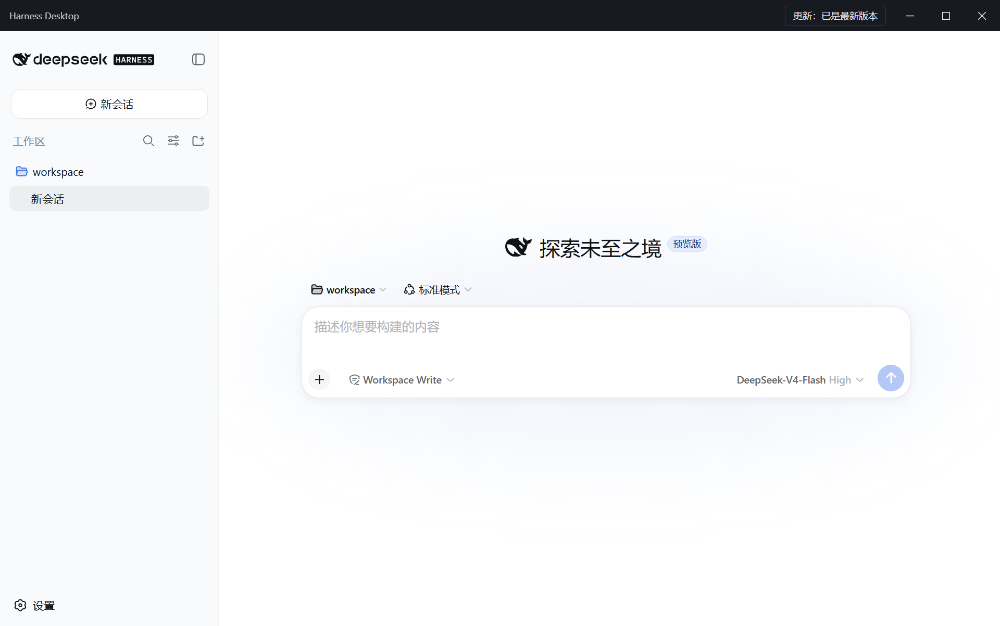
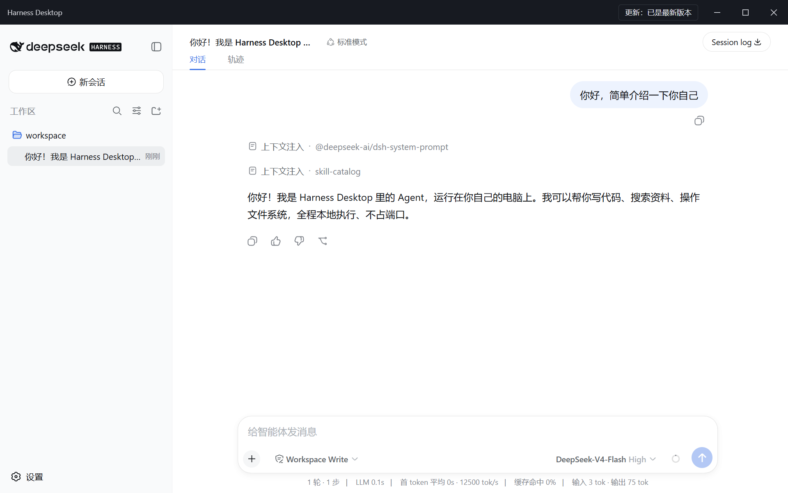
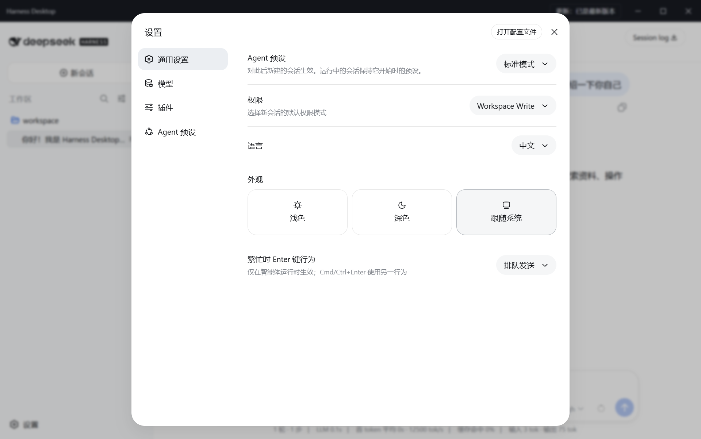

# Harness Desktop

[English](README.md) | 中文

> [DeepSeek Harness](https://github.com/deepseek-ai/deepseek-harness) 的 Windows 原生客户端——本地优先的 Agent 工作台。无边框自绘界面、托盘常驻、完整 Agent 运行时**进程内嵌**：没有 localhost 服务器、没有浏览器标签页、不占任何端口。你的 Agent，一键即达。


---

## 截图







*由打包版应用（隔离模式 + mock LLM）实拍，每次发布前重新截图。*

---

## 特性

- 🪟 **无边框窗口** — 自绘标题栏，自带窗口菜单（`Alt+Space`）、最大化 / 还原 / 最小化、关窗即入托盘
- 🧲 **托盘常驻** — 关闭窗口只是隐藏；随时从托盘打开主窗口或新建会话
- ⚡ **进程内运行时** — 完整 Harness 插件树运行在主进程内，通过白名单 IPC 桥通信：零 localhost HTTP 端口、零网络监听
- 🛡️ **加固渲染层** — `sandbox` + `contextIsolation`；主进程是唯一的系统能力边界
- 🔁 **自动更新** — 标题栏常驻入口：从本 fork 的 GitHub Releases 检查 / 下载 / 安装
- 📦 **一键诊断导出** — 导出带时间戳的诊断包（主日志 + 版本/环境快照）

---

## 安装

从 [Releases](https://github.com/zgc37359-lang/harness-desktop/releases) 下载最新安装包——`dsh-desktop-<version>-x64.exe`（NSIS 每用户安装，无需管理员权限）。

### 从源码构建

```sh
git clone https://github.com/zgc37359-lang/harness-desktop.git
cd harness-desktop
pnpm install
pnpm run build
pnpm --filter @deepseek-ai/dsh-desktop run dist:flat
```

桌面端源码在 `apps/desktop/`（详见其 [README](apps/desktop/README.md)）；NSIS 安装器与 `latest.yml` 更新清单输出到 `apps/desktop/dist-app2/`。

---

## 已知限制

- 配置代码签名证书前安装包未签名（安装时可能出现 SmartScreen 警告）。
- Windows 沙箱 `workspace-write` / `read-only` 模式下，基于 schannel 的 HTTPS 客户端（curl、PowerShell、.NET）会报 `SEC_E_NO_CREDENTIALS` 失败；Node/Python（OpenSSL）不受影响——受限会话内请用内置 web/search 工具，或对这类命令使用 `danger-full-access`。
- 一个会话只能由一个进程操作：不要同时用桌面端和 CLI 在同一个 `DSH_HOME` 下操作同一会话。

---

## 许可证

[MIT](LICENSE)
