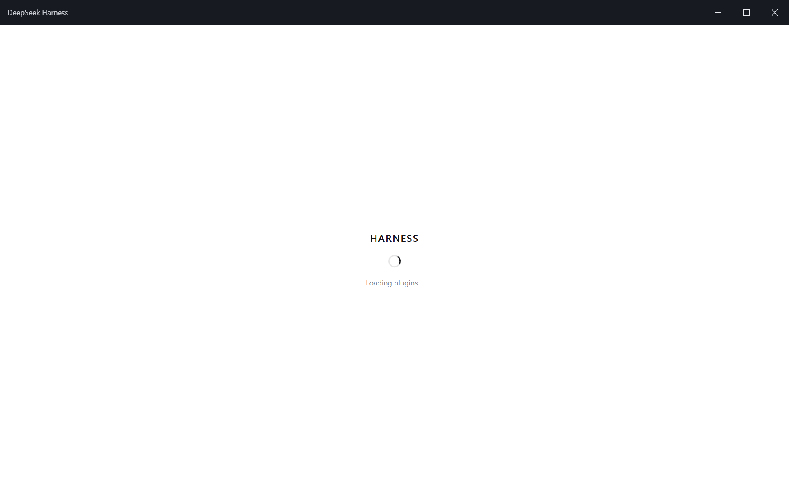

# DeepSeek Harness Desktop

[English](README.md) | 中文

> [DeepSeek Harness](https://github.com/deepseek-ai/deepseek-harness) 的 Windows 原生客户端——本地优先的 Agent 工作台。无边框自绘界面、托盘常驻、完整 Agent 运行时**进程内嵌**：没有 localhost 服务器、没有浏览器标签页、不占任何端口。你的 Agent，一键即达。


---

## ✨ 特性

| | |
|---|---|
| 🪟 **无边框窗口** | 完全自绘标题栏，自带窗口菜单（`Alt+Space`）、最大化 / 还原 / 最小化、关窗即入托盘 |
| 🧲 **托盘常驻** | 关闭窗口只是隐藏；托盘保持应用存活——随时打开主窗口或新建会话，无需碰桌面 |
| 🔒 **单实例** | 一个应用一棵进程树；再次启动只会聚焦已有窗口 |
| ⚡ **进程内运行时** | 完整 Harness 插件树运行在主进程内，通过白名单 IPC 桥与界面通信——**零 localhost HTTP 端口、零网络监听** |
| 🛡️ **加固渲染层** | `sandbox` + `contextIsolation` + 白名单 preload API；主进程是唯一的系统能力边界（窗口、托盘、对话框、剪贴板、下载、更新） |
| 🔁 **自动更新** | `electron-updater` 全链路接入——从 GitHub Releases 检查 / 下载 / 安装，界面可见状态 |
| 🧾 **持久化工具授权** | 按工作区、持久、可撤销的 Agent 工具调用审批（文件系统、Shell 等） |
| 📦 **一键诊断导出** | 导出带时间戳的诊断包（主日志 + 版本/环境快照），方便报 bug |

## 🖼️ 预览



*由 `pnpm run e2e:window` 对打包版应用生成——每次发布前重新截图。*

---

## 🚀 快速开始

### 安装

从 [Releases](https://github.com/zgc37359-lang/deepseek-harness/releases) 下载最新安装包——`dsh-desktop-<version>-x64.exe`（NSIS 每用户安装，无需管理员权限）。

### 从源码构建

```sh
git clone https://github.com/zgc37359-lang/deepseek-harness.git
cd deepseek-harness
pnpm install
pnpm run build
pnpm --filter @deepseek-ai/dsh-desktop run dist:flat
```

NSIS 安装器与 `latest.yml` 更新清单输出到 `apps/desktop/dist-app2/`。

### 开发

```sh
pnpm --filter @deepseek-ai/dsh-desktop run start
pnpm --filter @deepseek-ai/dsh-desktop run smoke
pnpm --filter @deepseek-ai/dsh-desktop run e2e:window
```

`start` 源码运行，`smoke` 无头启动检查，`e2e:window` 可见窗口 E2E 并生成上面的截图。

---

## 🏗️ 架构

```
┌───────────────────────────── Electron main process ─────────────────────────────┐
│  Window / Tray / Single-instance   ←   custom chrome, lifetime, lock            │
│  Whitelisted IPC bridge            ←   the only renderer→host channel           │
│  In-process Harness runtime        ←   full plugin tree, no webserver, no port  │
│  electron-updater / diagnostics    ←   update state machine, export bundle      │
└────────────────────────────────────────────────────────────────────────────────┘
              │ IPC (unary + event streams)
┌─────────────▼──────────────────────────────────────────────────────────────────┐
│  Renderer (sandboxed)                                                          │
│  Custom title bar  +  the full Harness Web UI over the desktop carrier        │
└────────────────────────────────────────────────────────────────────────────────┘
```

关键架构决策记录在本仓库的 [Agent Notes](../../.agents/notes/)：

- **[桌面 IPC 面](../../.agents/notes/implemented/architecture/2026-08-17-desktop-ipc-surface.md)** — 无 localhost HTTP：unary 调用与下行事件流走 Electron IPC；渲染层保持沙箱，主进程拥有全部系统能力。
- **[共享 RPC 链](../../.agents/notes/implemented/architecture/2026-08-17-desktop-bridge-rides-shared-rpc-chain.md)** — 桌面桥与 Web 面走同一网关，所有 UI 控件在两种形态下行为一致。
- **[扁平生产闭包](../../.agents/notes/implemented/process/2026-08-17-desktop-flat-production-closure.md)** — 可复现的 246 包 `node_modules` 扁平化，打包结果确定。

---

## 🧪 质量门禁

Windows CI 工作流（`windows-desktop.yml`）全部针对**打包后的 exe** 运行：

| 门禁 | 检查内容 |
|---|---|
| `soak-test` | mock LLM 驱动的 N 轮 UI 浸泡测试，把关主进程 RSS 与句柄增长 |
| `load-older-e2e` | 恢复超大会话，断言“加载更早”会可见地新增聊天节点 |
| `verify-install` | 校验打包闭包关键标记、安装与构建一致、smoke 启动 |
| `perf-smoke` | 冷启动 ≤ 15 秒，峰值内存 ≤ 1 GiB |
| `perf-test` | 事件循环漂移 p95 ≤ 50 ms，渲染 ≥ 30 FPS |
| `bench-stream` | 首 token ≤ 2 秒，≥ 100 字符/秒（mock LLM） |
| `pty-probe` | 打包版中 `node-pty` 原生绑定可加载 |
| `e2e-window` | 可见窗口启动、Web UI 挂载、最大化/还原与关窗入托盘正常 |
| `ui-matrix` | 壳/侧栏/输入区/设置/对话 60 步交互矩阵 |
| `stress-test` | 连发消息、120 行大输出、快速建会话、内存/事件循环预算 |
| `install-cycle` | 静默安装 → 冒烟 → 本地源升级（含损坏包错误路径）→ 静默卸载 → 残留检查（全新 hosted runner） |

---

## 📌 已知限制

- Win11 悬停 snap-layout 浮层在自绘最大化按钮上不可用；边缘拖拽吸附与 Win+方向键仍可用。
- 自定义窗口菜单的移动/缩放使用主进程光标循环。
- 配置代码签名证书前安装包未签名（SmartScreen 警告；自动更新在签名版本发布后才有意义）。
- 渲染层 CSP 允许 `unsafe-eval`（vendored Cordis Loader 需要求值配置表达式）；渲染层保持沙箱，主进程仍是能力边界。

---

## 🗺️ 路线图

完整工程计划见 [release-testing-plan.md](release-testing-plan.md)。简版：

- **产品基本盘** — 窗口状态记忆、可见的更新入口、日志轮转、崩溃可见性
- **桌面体验** — 全局快捷键、系统通知、标题栏跟随主题、更丰富的托盘
- **平台能力** — `dsh://` 深链、文件拖放、JumpList / 任务栏进度、MCP 管理界面
- **发布链路** — 代码签名、GitHub Releases 自动化、stable/beta 渠道、差分更新

---

## 📄 许可证

[MIT](../../LICENSE)
